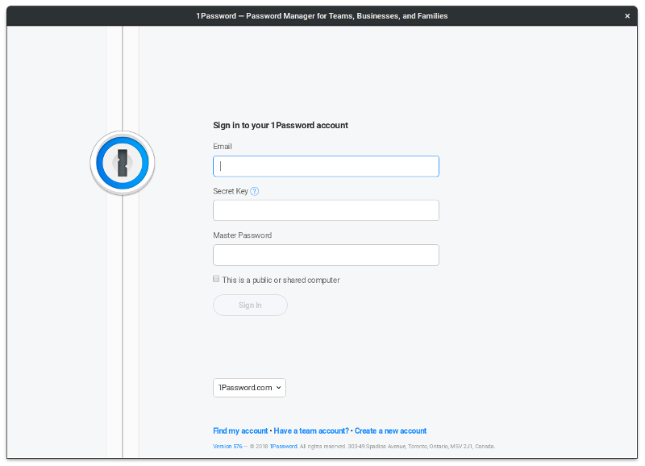

# 1password-linux [](https://github.com/ffflorian/1password-linux/actions/) [](https://dependabot.com)

Run [1Password](https://1password.com) on Linux.



## Installation

```
yarn
yarn dist
sudo dpkg -i wrap/dist/1password_*_amd64.deb
```

## Local usage

```
yarn start
```
